# market_jpa
Mini Market Application Based on  JPA and MVC2

  ## UML Class Diagram :
  
  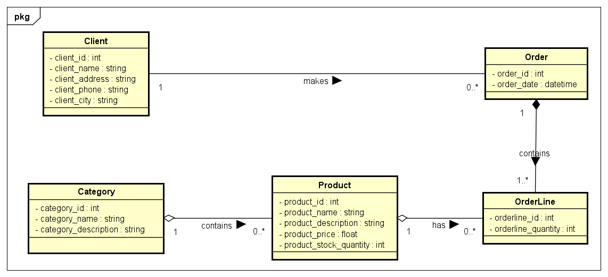
  
  ## Database Design :
  
  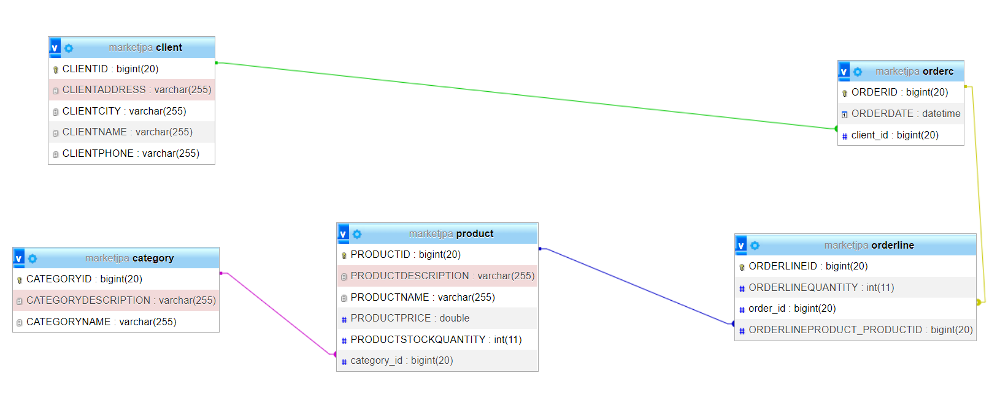

  ## Adding a client to the database :
  
  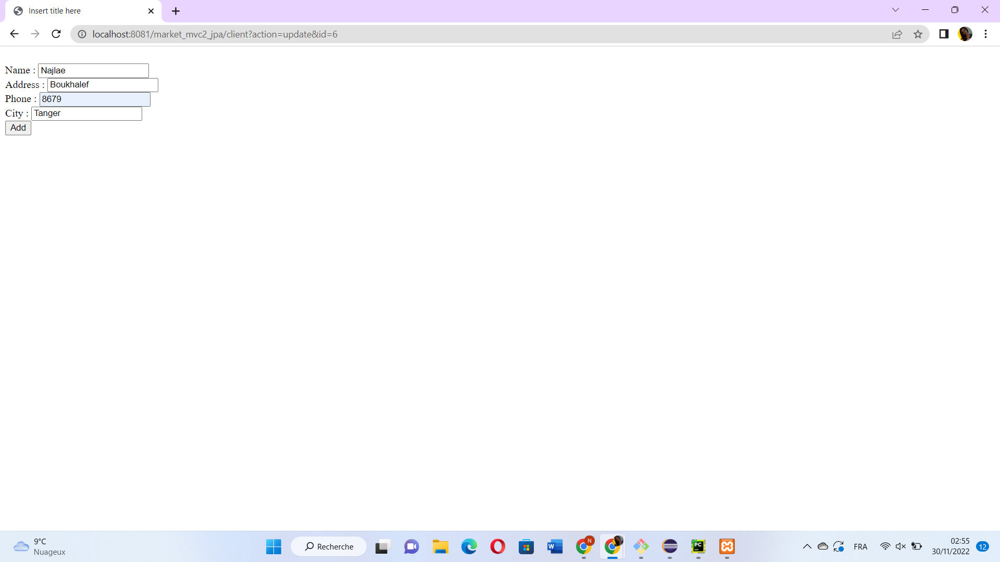
  
  ## Listing clients :
  
  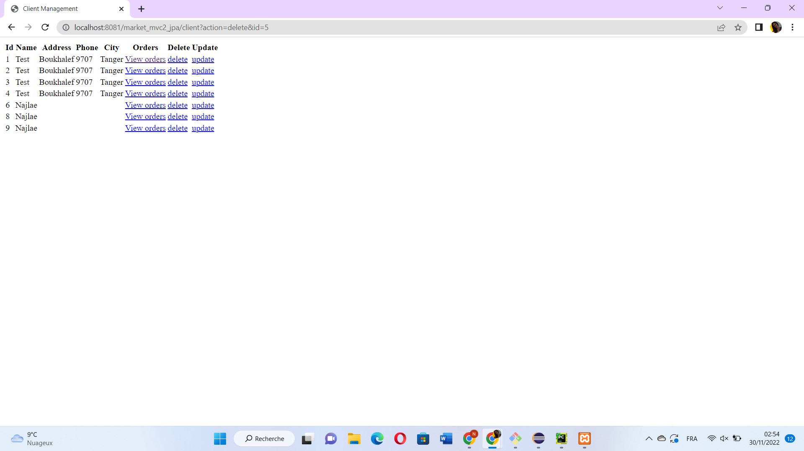
  
  ## Adding another client to the database :
  
  
  
  ## Listing clients :
  
  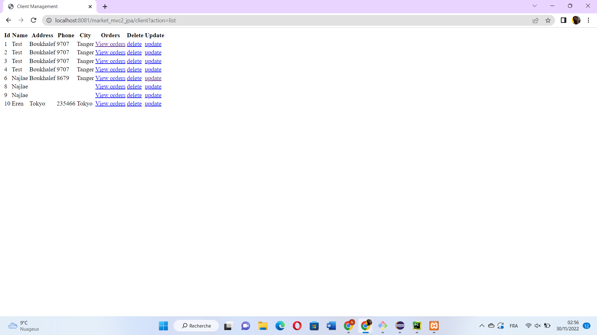
  
   ## Adding a category to the database :
  
  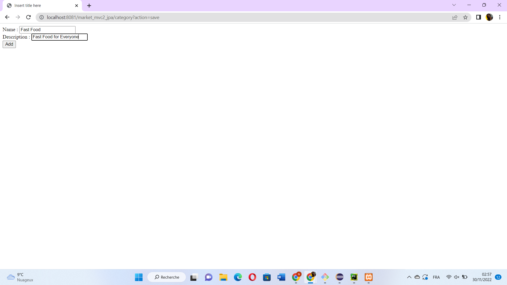
  
  ## Listing categories :
  
  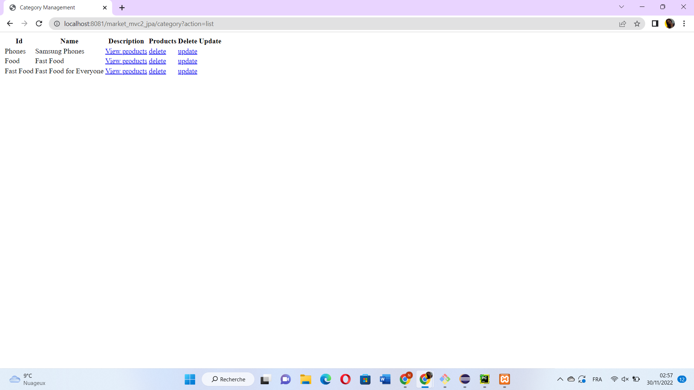
  
   ## Updating the category :
  
   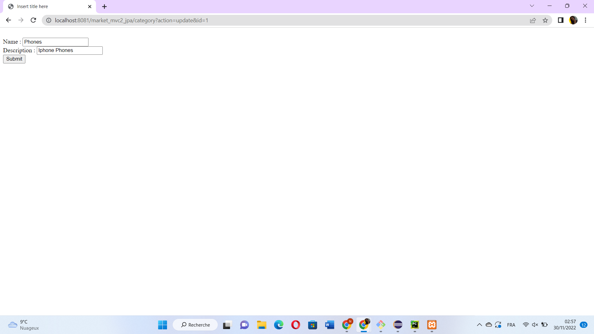
   
   
   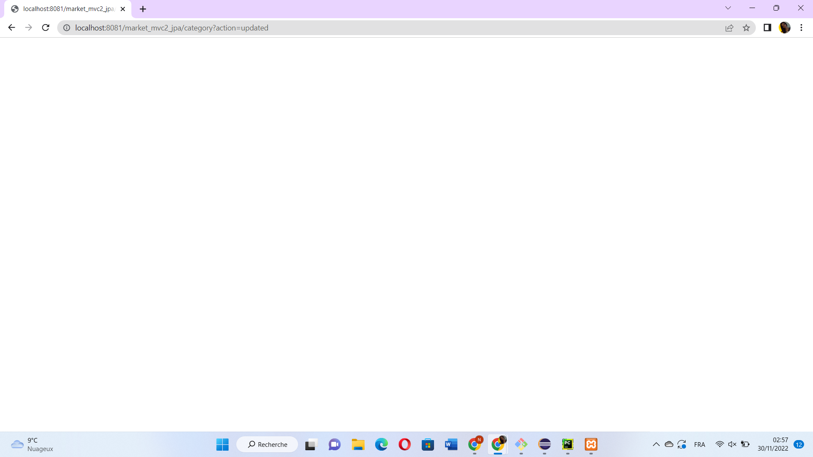
  
   ## Deleting the category with id = 2 :
  
   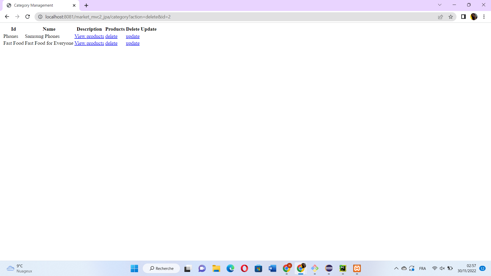
   
   ## Listing categories :
  
   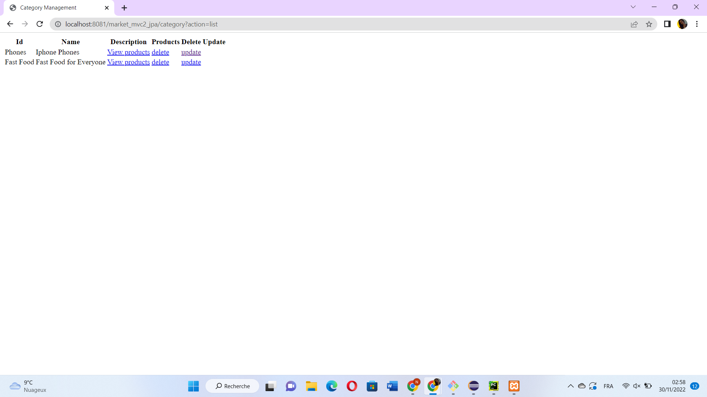
  
  ## Adding a product to the database :
  
  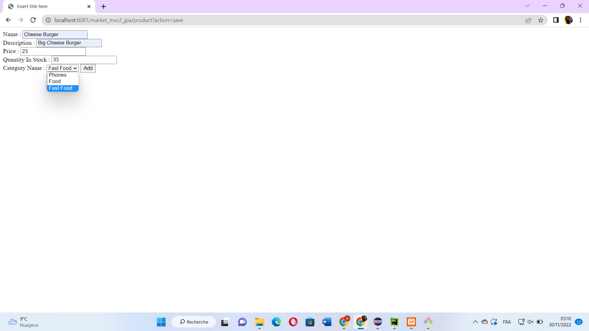
  
  ## Listing products By Category:
  
    
  
   ## Adding an order to the database :
   Available clients in the database are listed in the select tag.
    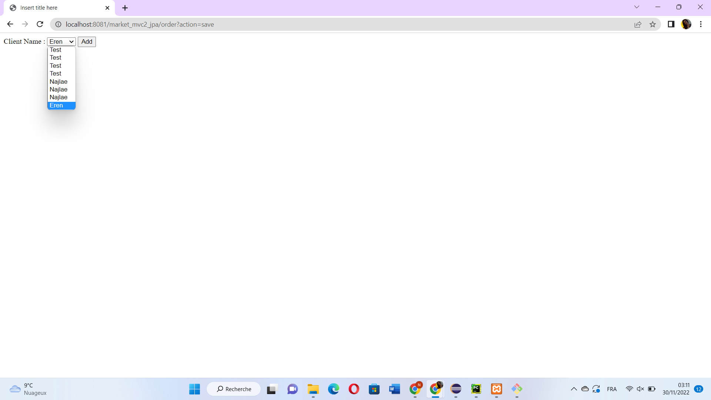
    
   ## Listing orders By Client:
  
   
  
   ## Adding an orderline to the database :
   
   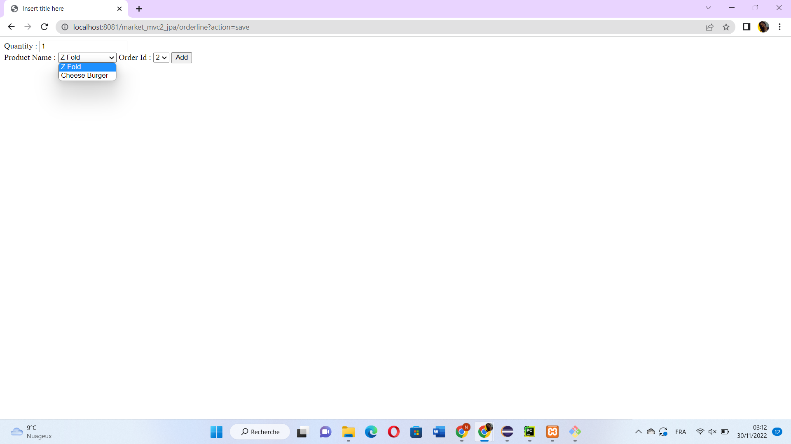
    
   ## Listing orderlines By Order:
  
   
   
   ## Updating the orderline's quantity :
  
   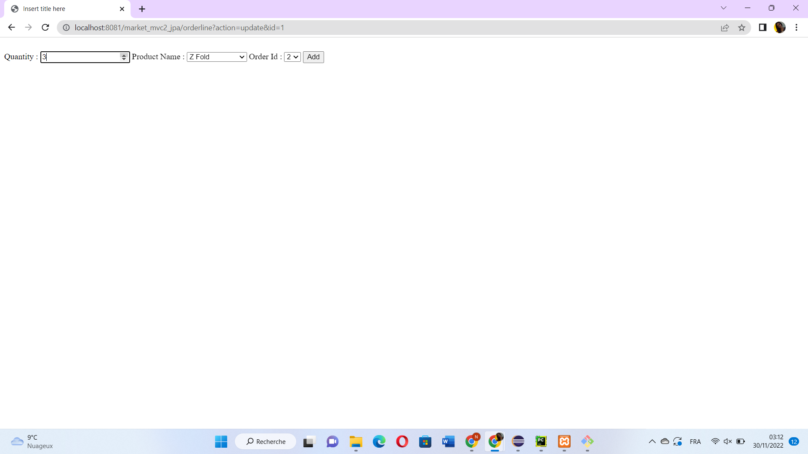
   
   ## Listing orderlines By Order After Update:
   
   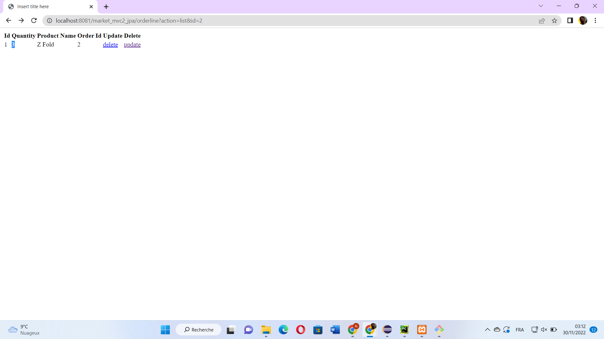
   
   ## Adding another orderline to the same order :
   
   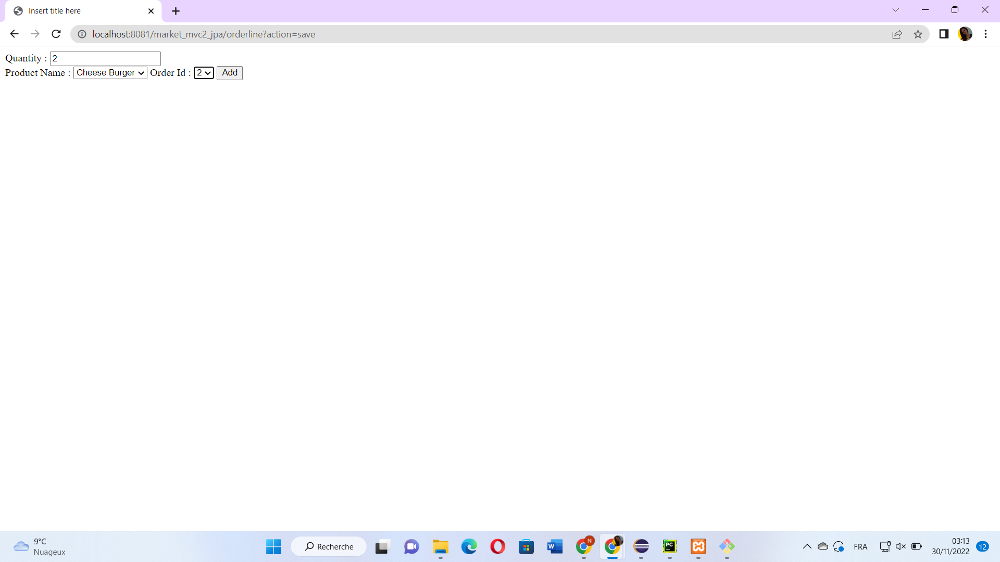
    
   ## Listing Orderlines By Order:
  
   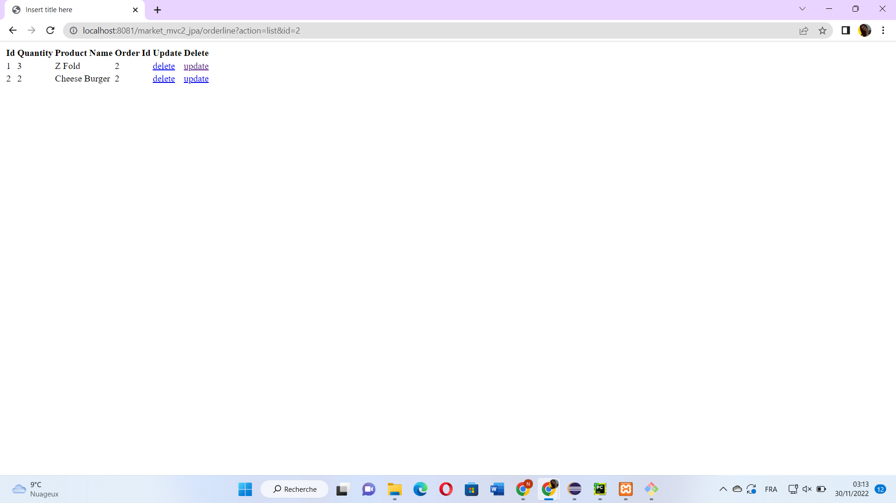
  
